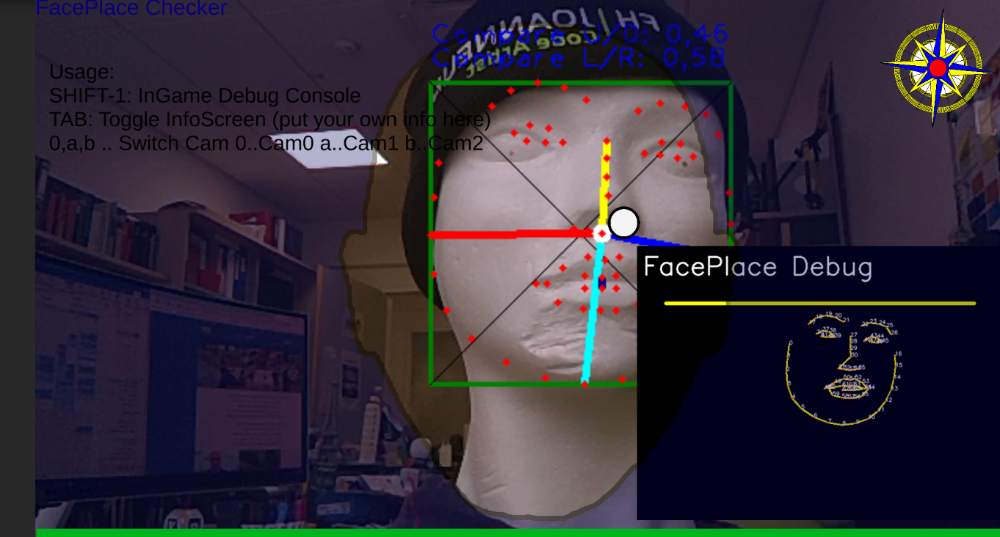
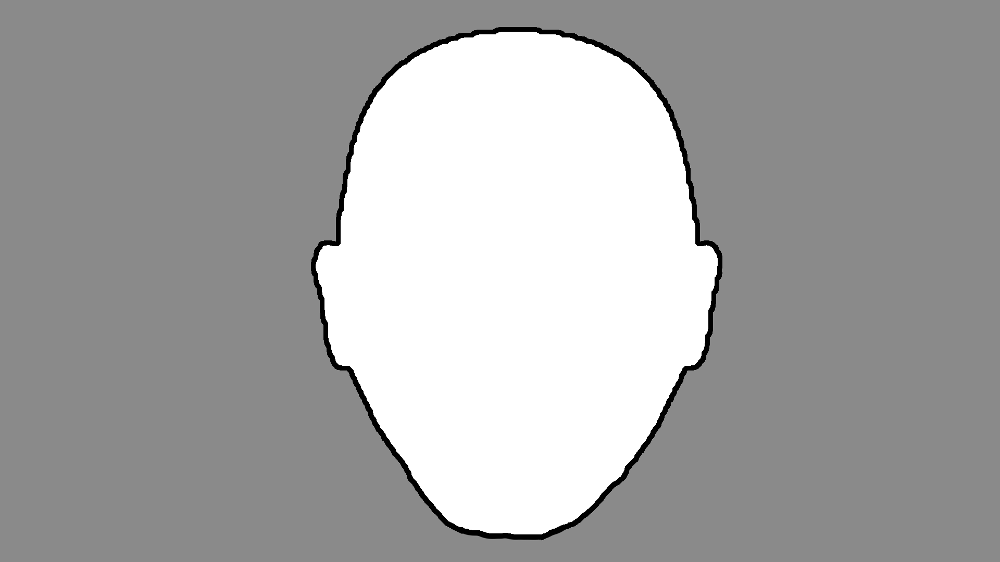

# OCV-face68-FaceMask - PLACE/SIZE Detection

With this code you can check if the face has the correct **size** inside the camera and is also **placed** correctly for best recognigion.



ColorCode:
* Red: Wrong
* Green: OK
* Blue: BoundingBox (Size) OK, Nose (Position) wrong
 
OpenCV Face68 FaceMask and BB Detection. 
Calculation of the own BB (BoundingBox) can be directly found [here on github](../../../OCV-face68-Nose-Mouth-BB).

Steps
1. Code for NoseNDC & BBNDC in Face68Detector
1. Daten in StaticStore speichern
1. GameObject (im Canvas) 
  - Image als UI Element
  - GameObject mit Image
  - C# Code am Image

## Check BB-Size (Bounding Box Size)
Check for correct face size
```
UnityEngine.Rect myBB = DMT.StaticStore.myBoundingBoxNDC;
float bbSize = myBB.width * myBB.height * 100;
// Debug.Log("BB-NDC: " + bbSize.ToString("000"));
// Debug.Log("Nose-NDC:" + DMT.StaticStore.NoseNDC);


bool okBB = false;
if ((minBB <= bbSize) && (bbSize <= maxBB)) okBB = true;
```

## Check Nose Point
Check for correct face position.
```
Vector2 myNoseNDC = DMT.StaticStore.NoseNDC*100;

bool okNose = false;
if (((noseX - noseDeltaX) <= myNoseNDC.x) && (myNoseNDC.x <= (noseX + noseDeltaX)) &&
    ((noseY - noseDeltaY) <= myNoseNDC.y) && (myNoseNDC.y <= (noseY + noseDeltaY))) okNose = true;
```



## Show Status

```
if (okBB && okNose)
  this.GetComponent<Image>().color = new Color32(0, 255, 0, 100); // GREEN
else
{
  if (okBB)
    this.GetComponent<Image>().color = new Color32(0, 0, 255, 100); // BLUE only BB
  else
    this.GetComponent<Image>().color = new Color32(255, 0, 0, 100); // RED no BB and Nose
  }
```

## Configuration Infos

Min and max Face BoundingBox Size for best size.

```
public int minBB = 11;
public int maxBB = 18;

public int noseX = 50;
public int noseY = 60;
public int noseDeltaX = 10; // +/-% for Nose NDC Point 
public int noseDeltaY =  7;  
```
